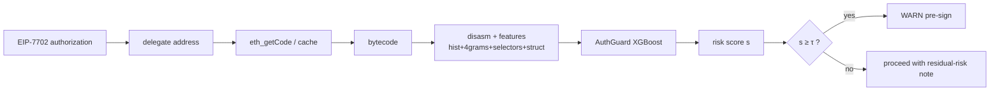
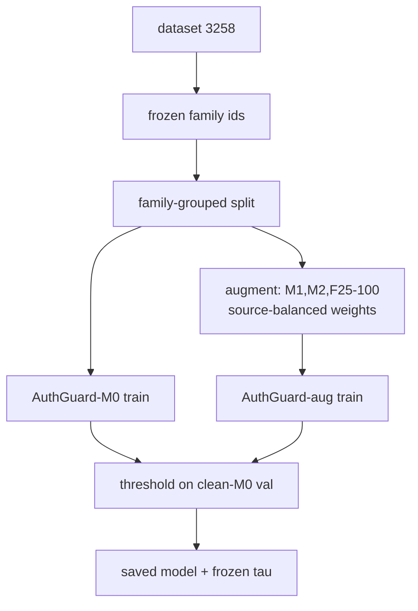

# System Architecture (Paper §6)

Four pipelines. Only implemented modules are shown; no explanation/calibration module is drawn
as production (the explanation audit exists as offline analysis only). Measured runtime is from
`results/supporting.json`; unmeasured stages are marked.

## Module tables

### 1. Offline dataset & training pipeline (G-DET / G-ADV)
| Module | Input | Processing | Output | Off/On | Runtime | Deps | Security role |
|--|--|--|--|--|--|--|--|
| Label ingest | USENIX artifact | parse rule outputs → 793 positives; assemble negatives | `capability_dataset.csv` | offline | — | pandas | defines ground truth (rule-derived) |
| Family freeze | bytecode | deterministic blake2b MinHash 4-grams, union-find @0.85 | `family_assignment_frozen.csv` | offline | ~15 s all rows | numpy | leakage control |
| Feature extract | bytecode | disasm → hist(225)+ngram(512)+selector+struct(261 dense) | `features_dense/ngram.npz` | offline | 3.4 ms/contract | ag_features | banned tautological/leaky feats |
| Train AuthGuard-M0/-aug | features+labels | XGBoost (frozen HP); aug adds M1/M2/F25-100 variants + source-balanced weights | fitted model | offline | ~60 s/fold (aug) | xgboost | the classifier |
| Threshold select | clean-M0 val | max-F1 on held-out-val families | frozen τ per fold | offline | — | numpy | operating point |

### 2. Online pre-signing inference pipeline
| Module | Input | Processing | Output | Off/On | Runtime | Deps | Security role |
|--|--|--|--|--|--|--|--|
| Auth parse | 7702 authorization | extract delegate address | address | online | µs | — | entry point |
| Code fetch | address | `eth_getCode` (or cache) | runtime bytecode | online | network/cache | RPC | data acquisition |
| Preproc+features | bytecode | disasm + feature vector | X | online | ~3.4 ms | ag_common/features | same feats as training |
| AuthGuard score | X | XGBoost predict_proba | s∈[0,1] | online | <1 ms | xgboost | risk score |
| Threshold+warn | s, τ | compare to frozen τ | flag/warning | online | µs | — | user-facing verdict |

### 3. Adversarial augmentation pipeline (G-ADV)
| Module | Input | Processing | Output | Off/On | Runtime | Deps | Security role |
|--|--|--|--|--|--|--|--|
| Mutation harness | M0 bytecode | metadata rewrite / addr-immediate / dead-code append / selector rewrite (domain-seeded) | M1,M2,M3,F25–F200 variants | offline | ms/variant | 04_mutations | evasion modeling |
| Preservation check | source+variant | assert opcode-skeleton/control-flow identity | pass/fail (793/793) | offline | — | ag_common | validity guarantee |
| Source-balance weights | variants | weight 1/(K+1) per source | sample weights | offline | — | pandas | anti-shortcut |

### 4. Evaluation pipeline
| Module | Input | Processing | Output | Off/On | Runtime | Deps | Security role |
|--|--|--|--|--|--|--|--|
| Leakage assertions | folds | source/family/hash disjoint; mutant family inheritance | pass log | offline | — | numpy | rigor guarantee |
| Metrics | scores+labels | AUPRC/AUROC/P/R/F1/FPR; paired bootstrap; Wilson | JSON tables | offline | — | sklearn | reported results |

## ASCII — online pre-signing path
```
7702 authorization request
      │  extract delegate address
      ▼
delegate address ──► eth_getCode / cache ──► runtime bytecode
      ▼
preprocessing + feature extraction (opcode hist + 4-grams + selectors + struct)   [~3.4 ms]
      ▼
AuthGuard (XGBoost)  ──►  risk score s∈[0,1]
      ▼
compare to frozen threshold τ  ──►  {ALLOW-ish , WARN}
```

## ASCII — offline training path
```
dataset ─► frozen family assignment ─► family-grouped split (train-fit / val / test)
        ─► [aug: M0,M1,M2,F25,F50,F100 + source-balanced weights]
        ─► model training (AuthGuard-M0 | AuthGuard-aug)
        ─► threshold selection (max-F1 on clean-M0 val)
        ─► saved model + frozen τ
```

## Mermaid — online pipeline


## Mermaid — offline + augmentation


**Proposed IEEE figure caption.** "Figure 1: AuthGuard-7702 architecture. Offline (top): a frozen
family clustering drives a leakage-safe split; AuthGuard-M0 and the augmented AuthGuard-aug are
trained with source-balanced structure-preserving variants, and a single threshold is fixed on
clean held-out validation. Online (bottom): at signing time the delegate's bytecode is fetched,
featurized, and scored in ~3.4 ms, with no decompiler in the loop."

**Recommended vector layout (TikZ).** Two horizontal bands (offline top, online bottom) sharing
the "saved model + τ" node; augmentation as a side-branch feeding only AuthGuard-aug; render the
online band as a single left-to-right pipe to emphasize latency. Do **not** draw explanation or
calibration boxes — not implemented as production modules.
